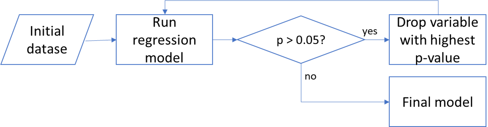
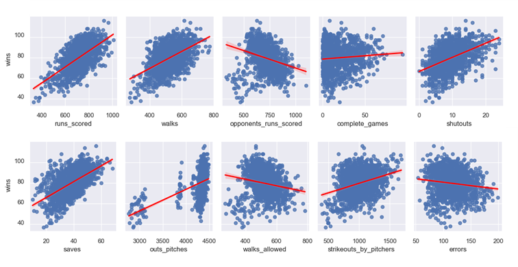
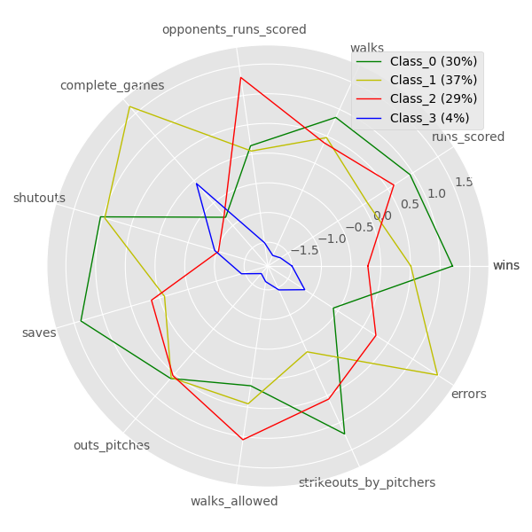

# Supervised Machine Learning - Regression Analysis
After initial data processing and cleaning, our dataset contained 1384 rows and 31 columns, corresponding to MLB stats from 1970 to 2019, including 36 teams, and the following metrics and variables:

<table cellpadding="5" cellspacing="1" border="1">
<tr><td>year</td><td>walks</td><td>saves</td></tr>
<tr><td>team_name</td><td>strikeouts_by_batters</td><td>outs_pitches</td></tr>
<tr><td>games_played</td><td>stolen_bases</td><td>hits_allowed</td></tr>
<tr><td>wins</td><td>caught_stealing</td><td>homeruns_allowed</td></tr>
<tr><td>losses</td><td>batters_hit_by_pitch</td><td>walks_allowed</td></tr>
<tr><td>runs_scored</td><td>sacrifice_flies</td><td>strikeouts_by_pitchers</td></tr>
<tr><td>hits</td><td>opponents_runs_scored</td><td>errors</td></tr>
<tr><td>doubles</td><td>earned_runs_allowed</td><td>double_plays</td></tr>
<tr><td>triples</td><td>complete_games</td><td>fielding_percentage</td></tr>
<tr><td>homeruns</td><td>shutouts</td><td>class'</td></tr>
</table>

We wanted to understand how much of the variability in the response variable y (number of “wins”) can be explained by changes in an X number of variables.
Additionally, we wanted to find whether the number of variables can be reduced without affecting the model score significantly.
Our approach was to perform a Stepwise Regression Analysis, which is the iterative construction of a model where independent variables are removed in succession and testing for statistical significance after each iteration (Kwok, 2021). This process is illustrated in the figure below.

After this process, our final model contained 10 independent variables (down from 24).
Furthermore, collinearity was tested using the Variance Inflation Factor, and one additional variable was dropped.
The final list of dependent variables are shown in the table below.

<table cellpadding="5" cellspacing="1" border="1">
<tr><td>runs_scored</td><td>saves</td></tr>
<tr><td>walks</td><td>outs_pitches</td></tr>
<tr><td>opponents_runs_scored</td><td>walks_allowed</td></tr>
<tr><td>complete_games</td><td>strikeouts_by_pitchers</td></tr>
<tr><td>shutouts</td><td>errors</td></tr>
</table>

We also tested the model performance and the results are listed below.
- R2 Score: 0.9304714673783749
- Training Score: 0.9303466731994289
- Testing Score: 0.9297116942632093

A pairplot was generated to visually explor how each independent variable correlated with the dependent variable ("wins"). The figure below shows the top row.

# Supervised Machine Learning - Regression Analysis

In this part of the project, we wanted to combined the classification work (unsupervised learning) and regression analysis (supervised learning) in one visualization of the different clusters and the 11 baseball statistics. We decided for using matplotlib to create a “radar chart,” which shows the relative values of all metrics and for the four clusters included. Data was normalized to the same scale using the spicy library, and its zcore tool. The resulting chart is shown next.

References:

Kwok, Ryan. 2021. Stepwise Regression Tutorial in Python. https://towardsdatascience.com/stepwise-regression-tutorial-in-python-ebf7c782c922
Chandradas, Abhijith. 2021. How to Create a Radar Chart in Python. https://towardsdatascience.com/how-to-create-a-radar-chart-in-python-36b9ebaa7a64
shivapriya1726. 2021. How to Standardize Data in a Pandas DataFrame? https://www.geeksforgeeks.org/how-to-standardize-data-in-a-pandas-dataframe/

